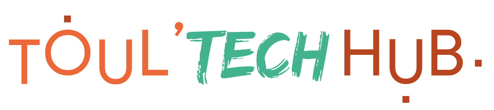

<!-- lead -->
<section class="py-1 text-center container">
  

    

      
      

          Retrouvez toutes les informations sur les communautés tech toulousaines sur une seule page.
      

    

  

</section>

<!-- agenda -->
<section class="container" id="agenda">

  <!-- title -->
  

    

      <h1 class="fw-light">Agenda</h1>
      

          Tous les prochains évènements des communautés tech toulousaines.
      

    

  

  <!-- ics / atom -->
  

    

      

        <i class="bi bi-calendar2-week"></i>&nbsp;iCal
        <input id="icsInput" type="text" value="{{ site.site }}{{ site.baseurl }}/events.ics" data-url="{{ site.site }}{{ site.baseurl }}/events.ics" readonly class="form-control" style="background-color:#fff" onfocus="this.select()">
        <button class="btn btn-outline-secondary" type="button" id="button-addon-ics" title="Copier l'URL dans le presse-papier" onclick="copyToClipboard('icsInput')"><i class="bi bi-clipboard-check"></i></button>
      

    

    

      

        <i class="bi bi-rss"></i>&nbsp;Rss/Atom
        <input id="atomInput" type="text" value="{{ site.site }}{{ site.baseurl }}/events.atom.xml" data-url="{{ site.site }}{{ site.baseurl }}/events.atom.xml" readonly class="form-control" style="background-color:#fff" onfocus="this.select()">
        <button class="btn btn-outline-secondary" type="button" id="button-addon-atom" title="Copier l'URL dans le presse-papier" onclick="copyToClipboard('atomInput')"><i class="bi bi-clipboard-check"></i></button>
      

    

  

  <!-- json -->
  

    

      

        <i class="bi bi-braces"></i>&nbsp;Json
        <input id="jsonInput" type="text" value="{{ site.site }}{{ site.baseurl }}/events.json" data-url="{{ site.site }}{{ site.baseurl }}/events.json" readonly class="form-control" style="background-color:#fff" onfocus="this.select()">
        <button class="btn btn-outline-secondary" type="button" id="button-addon-json" title="Copier l'URL dans le presse-papier" onclick="copyToClipboard('jsonInput')"><i class="bi bi-clipboard-check"></i></button>
      

    

  

  <!-- calendars -->
  

    

      {% assign current_month = site.time | date: "%m" %}
      {% assign current_year = site.time | date: "%Y" %}
      {% assign current_day = site.time | date: "%d" %}
      
    

    

      {% assign next_month = site.time | date: "%m" | plus: 1 %}
      {% assign next_year = site.time | date: "%Y" %}
      
        
        
      
      
      
    

    

      {% assign third_month = site.time | date: "%m" | plus: 2 %}
      {% assign third_year = site.time | date: "%Y" %}
      
        
        
      
      
      
    

  

  <!-- grid -->
  

{%- assign now_time = site.time | date: "%s" | plus: 0 -%}

  {%- assign event_time = event.dateIso | date:"%s" | plus: 0 -%}
  
    
  

  {%- assign event_date = event.dateIso | date: "%Y-%m-%d" -%}
  

    

      
🧑‍💻 {{ event.community }}

      <a href="{{ event.link }}">
        
        

          <h5 class="card-title">{{ event.title }}</h5>
          

          

          

            <small class="text-muted place">
            
            🏠 {{ event.place }} 📍 {{ event.placeAddr }}
            
            🌍 en ligne
            
            </small>
            <small class="text-muted text-end time">{{ event.dateFr }}📅 {{ event.timeFr }}⌚</small>
          

        

      </a>
    

  



  

</section>

<!-- conférences -->
<section class="container my-2" id="conferences">

  <!-- title -->
  

    

      <h1 class="fw-light">Conférences</h1>
      

        Les grandes conférences tech annuelles sur Toulouse !
      

    

  

  

</section>

<!-- communautés -->
<section class="container my-2" id="communautes">

  <!-- title -->
  

    

      <h1 class="fw-light">Communautés</h1>
      

        La liste des communautés tech toulousaines référencées.
      

    

  

  <!-- list -->
  

  
  
  
    community-gdg
    community-mtg
    community-agile
    community-tgd
    community-ruby
    community-jug
    community-python
    community-js
    community-default
    
  
  

    
    
      
        
      
        
      
    
    

      

        <h5 class="community-card-title">{{ group.name }}</h5>
        
        
{{ group.content | strip_html | truncatewords: 15 }}

        
        
{{ group.description | strip_html | truncatewords: 15 }}

        
        

          <a href="{{ group.url }}" title="Site Web" target="_blank"><i class="bi bi-globe"></i></a>
          
            
              
              <a href="{{ social.url }}" title="X / Twitter" target="_blank"><i class="bi bi-twitter-x"></i></a>
              
              <a href="{{ social.url }}" title="LinkedIn" target="_blank"><i class="bi bi-linkedin"></i></a>
              
              <a href="{{ social.url }}" title="GitHub" target="_blank"><i class="bi bi-github"></i></a>
              
              <a href="{{ social.url }}" title="Mastodon" target="_blank"><i class="bi bi-mastodon"></i></a>
              
            
          
        

      

    

  

  
  

</section>

<footer class="text-muted py-5">
  

    

      <a href="#">⬆️Retour en haut</a>
    

    

      ❓Votre communauté ou votre évènement n'est pas présent et vous souhaitez qu'il soit ajouté ? 
      👉Venez le signaler sur le <a href="https://github.com/GDGToulouse/toulouse-tech-hub">projet github.com</a>. 
      ⚖️<a href="mentions.html">Mentions légales</a>
    

    <!-- 
Album example is © Bootstrap, but please download and customize it for yourself!
 -->
    <!-- 
New to Bootstrap? <a href="/">Visit the homepage</a> or read our <a href="/docs/5.0/getting-started/introduction/">getting started guide</a>.
 -->
  

</footer>
