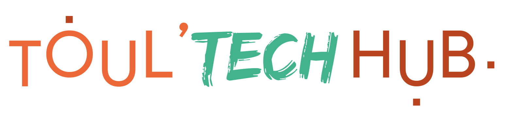

<!-- lead -->
<section class="py-1 text-center container">
  

    

      
      

          Retrouvez toutes les informations sur les communautés tech toulousaines bénévoles sur une seule page.
      

    

  

</section>

<!-- agenda -->
<section class="container" id="agenda">

  <!-- title -->
  

    

      <h1 class="fw-light">Agenda</h1>
      

          Tous les prochains évènements des communautés tech toulousaines.
      

    

  

  

</section>

<!-- conférences -->
<section class="container my-2" id="conferences">

  <!-- title -->
  

    

      <h1 class="fw-light">Conférences</h1>
      

        Les grandes conférences tech annuelles sur Toulouse !
      

    

  

  

</section>

<!-- communautés -->
<section class="container my-2" id="communautes">

  <!-- title -->
  

    

      <h1 class="fw-light">Communautés</h1>
      

        La liste des communautés tech toulousaines bénévoles référencées.
      

    

  

  

</section>

<footer class="text-muted py-5">
  

    

      <a href="#">⬆️Retour en haut</a>
    

    

      ❓Votre communauté ou votre évènement n'est pas présent et vous souhaitez qu'il soit ajouté ? 
      👉Venez le signaler sur le <a href="https://github.com/GDGToulouse/toulouse-tech-hub">projet github.com</a>. 
      ⚖️<a href="mentions.html">Mentions légales</a>
    

  

</footer>
